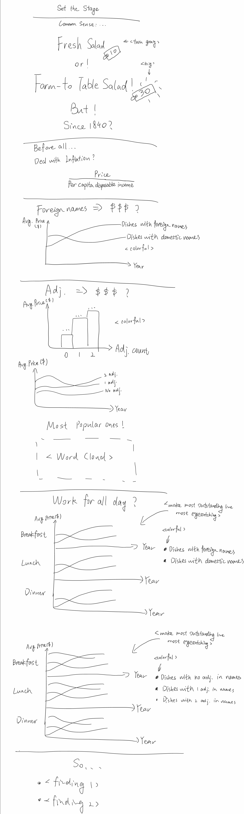

| [home page](https://serena-xue.github.io/2025Spring-Telling-Stories-with-Data/) | [data viz examples](dataviz-examples) | [critique by design](critique-by-design) | [final project I](final-project-part-one) | [final project II](final-project-part-two) | [final project III](final-project-part-three) |

# Outline
> Include a high-level summary of your project.  This should be a couple paragraphs that describe what you're interested in showing with your final project.

This project explores if foriegn and descriptive names make dishes more expensive, and if this has been true since 1840. In addition, I checks if theses tricks work all day, from breakfast to dinner. Finally, give some conclusions.

The story starts with a common sense: dish with a fancier name is more expensive. An example of "Fresh Salad" with a price tag and "Farm-To-Table Salad" with a higher price tag is showed. Then, ask a question: does that work since 1840?

Before start, the way to deal with inflation when comparing prices from history is important. I use price divided by per capita disposable income to get this.

Two factors to decide "fancy" are proposed. First is foreign words in dish names. Use a line plot to show its influence on prices since 1840. Second is adjectives in dish names. Use a bar plot to show influence of number of adjectives on average prices and a line plot to show its change since 1840. Use a word cloud to find out most popular adjectives.

Next, find if the two findings work for all day, from breakfast to dinner. Use two Faceted Line Charts to show that. Finally, show findings as conclusion.

> Project Structure 

- Set the Stage
 - Common sense: dish with a fancier name is more expensive. Does that work since 1840?
	- Deal with inflation
- Does a Foreign Dish Name Bring a Higher Price?
- Does a Descriptive Dish Name Come with a Higher Price Tag?
	- Adjectives and price
	- Popular Adjectives
- Breakfast vs. Lunch vs. Dinner
	- Does foreign-name rule works all day long?
	- How about adjectives?
- Summary

## Initial sketches
> Post images of your anticipated data visualizations (sketches are fine). They should mimic aspects of your outline, and include elements of your story.  

# The data
> A couple of paragraphs that document your data source(s), and an explanation of how you plan on using your data. 

Description:

Cited from [here](https://www.kaggle.com/datasets/nypl/whats-on-the-menu): "The New York Public Library is digitizing and transcribing its collection of historical menus. The collection includes about 45,000 menus from the 1840s to the present, and the goal of the digitization project is to transcribe each page of each menu, creating an enormous database of dishes, prices, locations, and so on. As of early November, 2016, the transcribed database contains 1,332,279 dishes from 17,545 menus."

Data source page: [https://www.nypl.org/research/support/whats-on-the-menu](https://www.nypl.org/research/support/whats-on-the-menu)

Data description: [http://curatingmenus.org/data_dictionary/](http://curatingmenus.org/data_dictionary/)

Download dataset: [https://www.kaggle.com/datasets/nypl/whats-on-the-menu](https://www.kaggle.com/datasets/nypl/whats-on-the-menu)

The dataset contains 4 tables: Menu, Dish, MenuPage, MenuItem. This project use Menu, MenuItem and Dish. Needed fields are:
- From table Dish: 
	- id: dish id
	- name: name of dish
- From table MenuItem:
	- dish_id: foreign key, from dish.id
	- price: price of this item
	- menu_id: foreign key, from menu.id
- From table Menu:
	- id: menu id
	- event: breakfast, lunch, dinner

# Method and medium
> In a few sentences, you should document how you plan on completing your final project. 

Use Python to detect foreign words and adjectives in dish names with lingua and nltk. Use Tableau to draw plots.

## References
[https://www.kaggle.com/datasets/nypl/whats-on-the-menu](https://www.kaggle.com/datasets/nypl/whats-on-the-menu)

## AI acknowledgements
_If you used AI to help you complete this assignment (within the parameters of the instruction and course guidelines), detail your use of AI for this assignment here._
